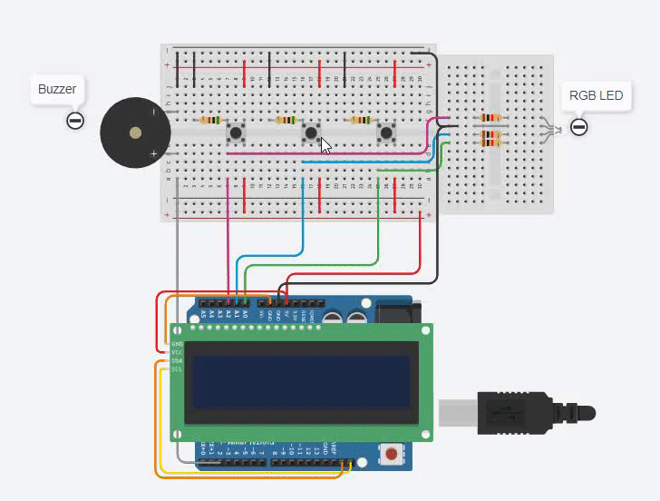

## Necessary Materials

* 1x Arduino Uno R3;
* 1x MCP23008-based,32 LCD 16 X 2 (I2C);
* 3x Pushbutton;
* 3x resistors (I used 1k ohm);
* 3x resistors (I used 0.5k ohm);
* 1x Buzzer & RGB LED;
* Extra (Breadboard, wires, soldering iron etc.)<!-- I don't need these materials for my project -->

## Circuit Simulation

## Note :warning:

> Pay attention to the pin numbers in the source code to make it work!
